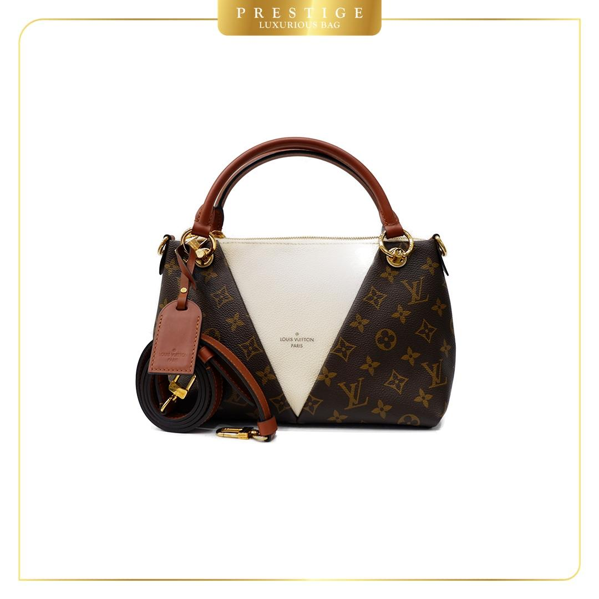

# BG Bot - Photo Background Remover

This Discord bot is designed to simplify the photo editing process for a bag store located in Artha Gading Mall (North Jakarta). As an editor and photographer at the store, I created this bot to remove backgrounds from product photos and apply new backgrounds seamlessly. By using Discord as the platform, it streamlines the editing workflow, saving time and effort. 

## Technologies Used
- **discord.py**: This library allows us to create and interact with the Discord bot easily. It provides the necessary tools to manage the bot's functionalities within the Discord server.

- **rembg library**: The `rembg` library is used for background removal. It enables the bot to remove the existing background from photos efficiently. We import this library using `from rembg import remove`.

- **PIL (Python Imaging Library)**: The `PIL` library helps us work with images in Python. It allows the bot to process the modified images and apply new backgrounds. We import this library using `from PIL import Image`.

## Bot Functionality
When the bot receives product photos, it performs the following tasks:

1. Background Removal: The bot uses the `rembg` library to remove the background from the photos, leaving only the product image.

2. Applying New Background: The bot applies a new background format to the product photos, ensuring they are ready for use in different contexts, such as social media posts or marketing materials.

3. Sending Modified Photos: The bot sends back directly edited product photos, ready to be used for various purposes.

Please note that this bot is specifically created for the bag store in "Mall Artha Gading".

## Bot Command

  
   
  <em>Here's the bot command example</em>

## Result
Below is an example of the input and output that bot produces in the realtime

  

    
     
    <em>Before</em>
  

  

    
     
    <em>After</em>
  

  

    
     
    <em>Before</em>
  

  

    
     
    <em>After</em>
  

Please note that the provided examples are for illustration purposes only and may not reflect the actual edited photos. The quality and appearance of the edited photos may vary based on the specific implementation of the bot and the input photos provided by the user.

There are multiple examples of product photos that have been processed by the bot in the output file.
[Click here to view the output folder](output/)

